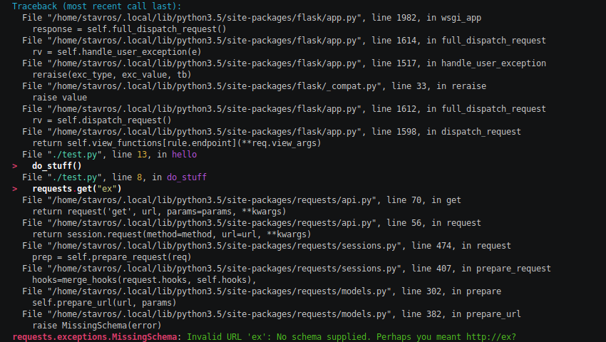
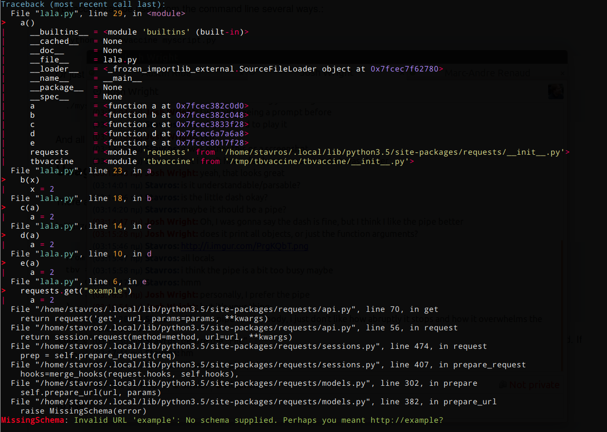

TBVaccine
---------

TBVaccine is a utility that pretty-prints Python tracebacks. It automatically
highlights lines you care about and deemphasizes lines you don't, and colorizes
the various elements in a traceback to make it easier to parse.

Here are some screenshots. This is the before:

.. image:: misc/before.png

And this is the after:

If you add the hook or call TBVaccine in your code, it can also print all
variables in each stack frame. That is, it turns this:

.. image:: misc/before-vars.png

into this:

Installation
============

To install, use ``pip``::

    pip install tbvaccine

You are done!

Usage as a command-line utility
===============================

TBVaccine can be used from the command line several ways.::

    python -m tbvaccine myscript.py

Or just pipe STDERR into it from the program you want to watch::

    ./myscript.py 2>&1 | tbvaccine

And all the tracebacks will now be pretty!

Usage as a Python library
=========================

There are various ways to use TBVaccine as a Python library.

Initialize it like so::

    from tbvaccine import TBVaccine
    tbv = TBVaccine(
        code_dir="/my/code/dir",
        isolate=True
    )

``code_dir`` marks the directory we code about. Files under that directory that
appear in the traceback will be highlighted. If not passed, the current
directory, as returned by ``os.getcwd()`` will be used.

If ``isolate`` is ``False``, all lines are colorized, and ``code_dir`` is
ignored.

If ``show_vars`` is ``False``, variables will not be printed in each stack
frame.

To use it in an ``except`` block::

    from tbvaccine import TBVaccine
    try:
        some_stuff()
    except:
        print(TBVaccine().format_exc())

To make it the default way of printing tracebacks, use ``add_hook()`` (which
also accepts any argument the ``TBVaccine`` class does)::

    import tbvaccine
    tbvaccine.add_hook(isolate=False)

    1 / 0

Bam! Instant pretty tracebacks.

Epilogue
========

This library is still pretty new, please contribute patches if something doesn't
work as intended, and also please tell your friends about it! Hopefully one day
it will be implemented in the Python interpreters themselves.

-- Stavros
